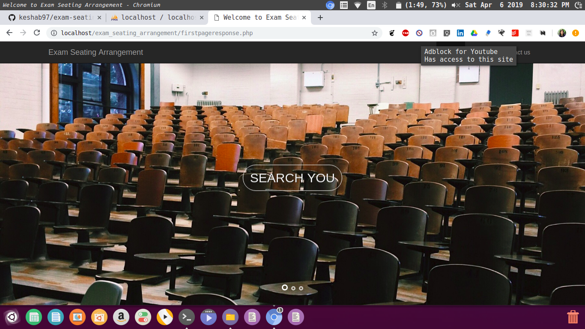

# exam-seating-arrangement-system

During exam period it is very hectic task to find out where is your examination hall and on which seat would allocate 
to a perticular student.This is an web application develop to help student to find out their respective examination hall during semester exam.
This would also shows the respective seat of a student in a perticular row and also the schedule of their examination.

It is an application on which you can search your roll number to find out your examination classroom.I you want to know about your
whole class then this facility is also avilable you just have to search your class year and branch.
You can also enter examination hall room number to see which class is allocated to which examination hall.

This one is develop using HTML , bootstrap and LAMP(Linux ,Apache ,MySQL , PHP).

Some changes could be done here to make it more reliable and more automatic like sending a msg to student for their ex.hall and timetable etc.

- **Activity Diagram**

 

## Instructions

##### important* As I used PHP hence move this repository in */var/www/html* folder. 
#### Admin :
- Please change Password in phpmyadmin because I have use **alkesha15** as password.If you don't want to change phpmyadmin password then please change password in each php file and update it same as your password

- In PhpMyadmin create **trial** database and import all sql files given in folder sqlfile in this repository
database look like -

 

- add csv file according to your college student detail(as I have created only sample student data here but in real project I had used data provided by my college) and subject detail in each sql table.(check format of studenttable.csv file in studenttable.sql and format of subjecttable.csv file in subjecttable.sql  in phpmyadmin.)
upload this csv file to its respective table.

- admin username and password of exam seating arrangement site is :
  **username**:user 
  **password**:user
  
  
   
- after that you can Add exam seating arrangement accordingly

 
- seating arrangement filling

 
#### User :

 

 
