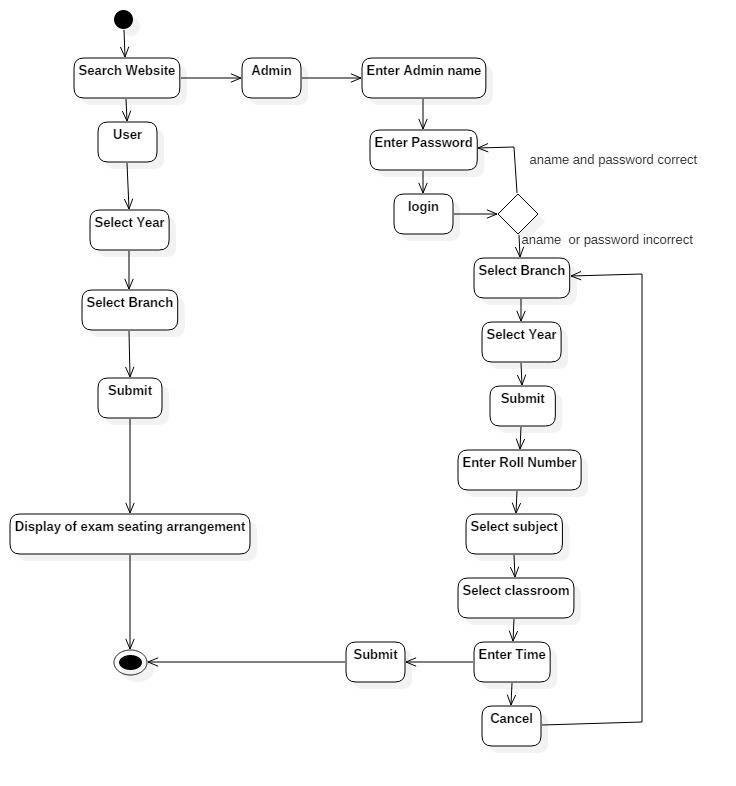
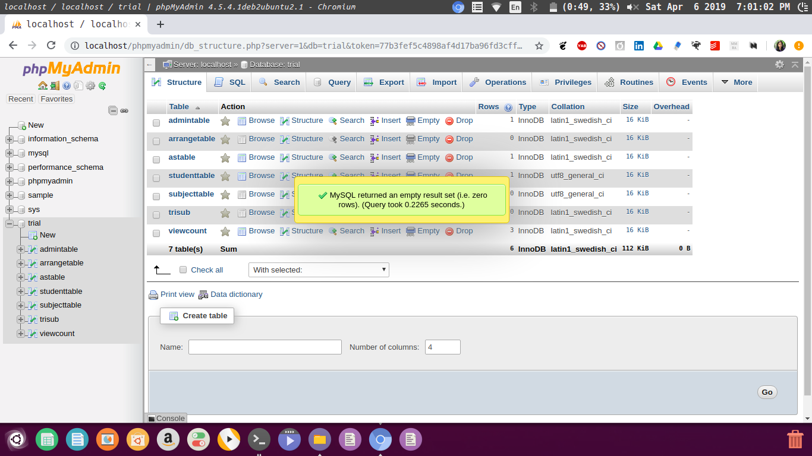
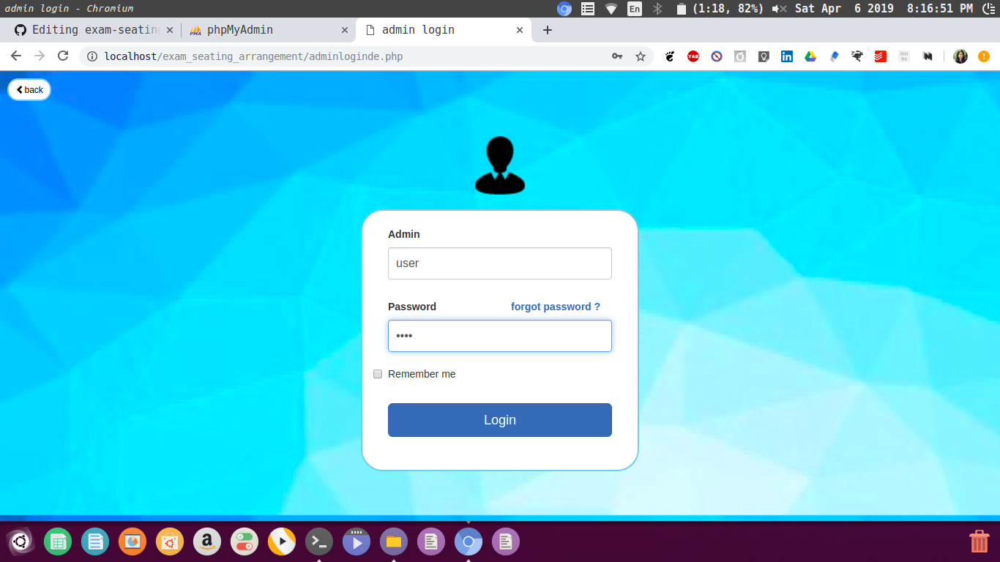
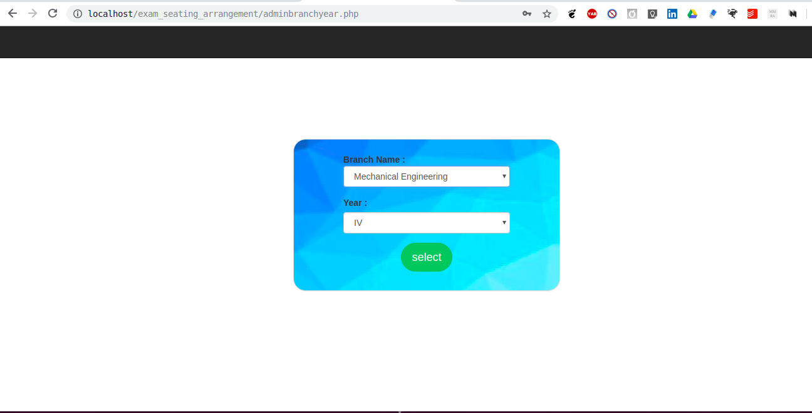
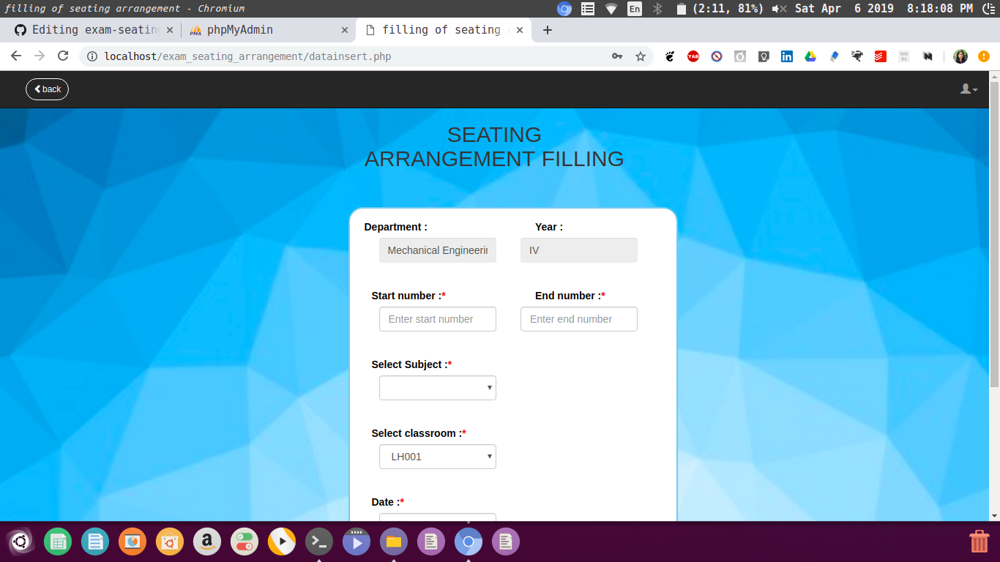
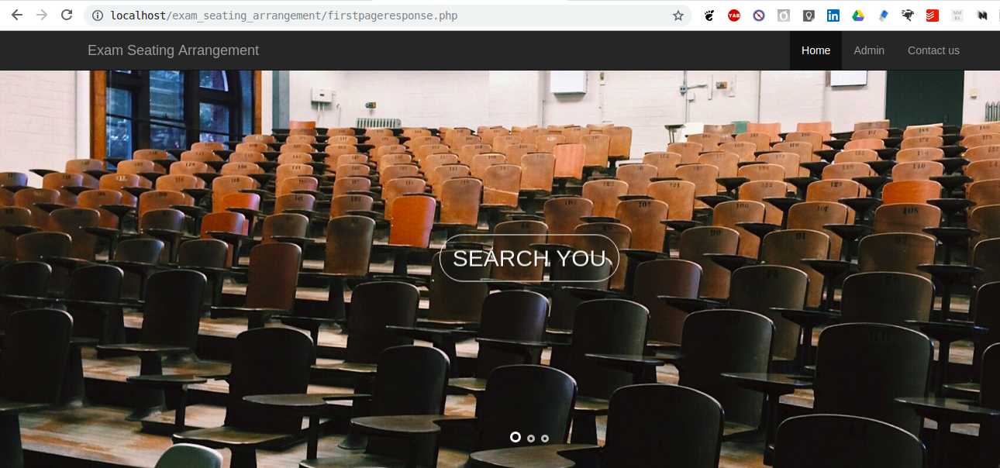
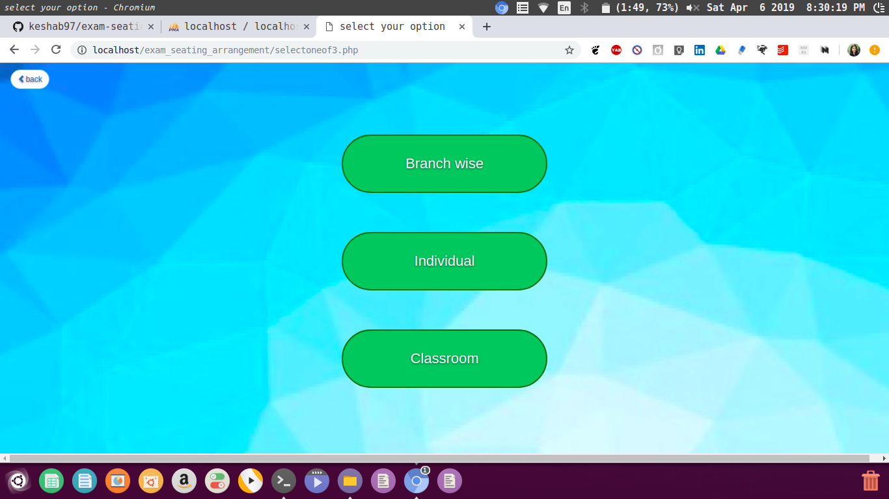

# exam-seating-arrangement-system
**I had created this project as my Software Engineering Project in 6th Semester.**
<br/>
<br/>
During exam period it is very hectic task to find out where is your examination hall and which seat would allocate 
to a perticular student.This is a web application developed to help students to find out their respective examination hall during semester exam.
This would also shows the respective seat of a student in a perticular row and also the schedule of their examination.

It is an application in which you can search your roll number to find out your examination classroom.If you want to know about your complete class then this facility is also available you just have to search your class , year and branch.
You can also enter examination hall number to see which class is allocated to which class.

This one is develop using HTML , bootstrap and LAMP(Linux ,Apache ,MySQL , PHP).

Some changes could be done here to make it more reliable and more automatic like sending a message to students about their examination hall and timetable etc.

Requirements to run this are : LAMP/XAMPP/WAMP ,PhpMyAdmin
<br/>
 Restart apache2 using-
```sudo service apache2 restart
```


- **Activity Diagram**

<br/>


## Instructions

##### important- As I used PHP hence move this repository in */var/www/html* folder in your PC(this is for Linux). 
#### Admin :
- Please change Password in phpmyadmin because I have used **alkesha15** as password.*If you don't want to change phpmyadmin password then please change password in each php file and update it same as your password.*(And this second option of changing password in each php file is more prefereable).

- In PhpMyadmin create database named **trial** in phpmyadmin and import all sql files given from folder **sqlfile** *present in this repository* to **trial** database in phpmyadmin.
database look like -

<br/>

- add csv file according to your college studenttable.csv(As I have created only sample student data here but in real project I had used data provided by my college) and subjecttable.csv in respective sql table.(check format of studenttable.csv file in studenttable.sql and format of subjecttable.csv file in subjecttable.sql  in phpmyadmin OR you can check format in give subjecttable.csv and studenttable.csv files from folder **sqlfile** in this repository)
upload this csv file to its respective table.

- admin username and password of exam seating arrangement site is :
  **username**:user 
  **password**:user
  
  
  <br/>
- after that you can Add exam seating arrangement accordingly


<br/>
- seating arrangement filling


<br/>

#### User :



<br/>



<br/>

**Note :**
##### *If you use this application please... kindly use your own database data.*

